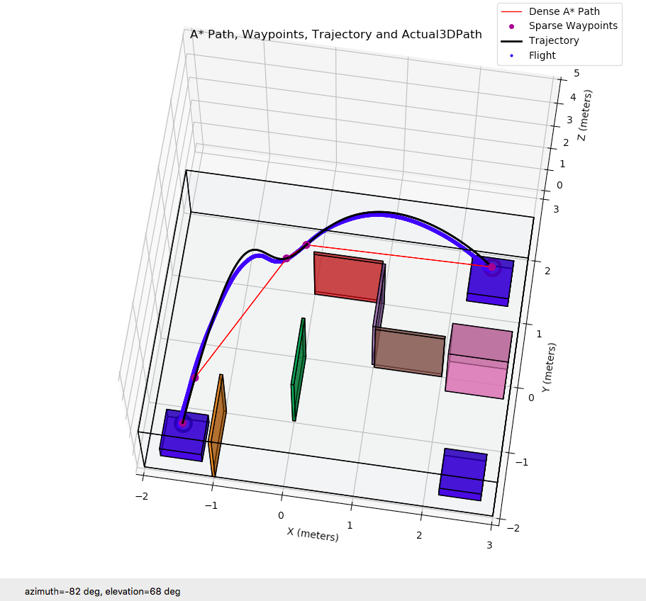
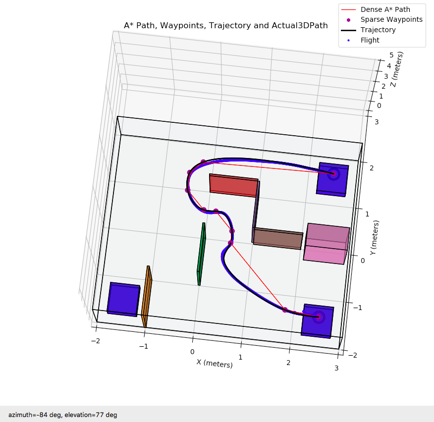
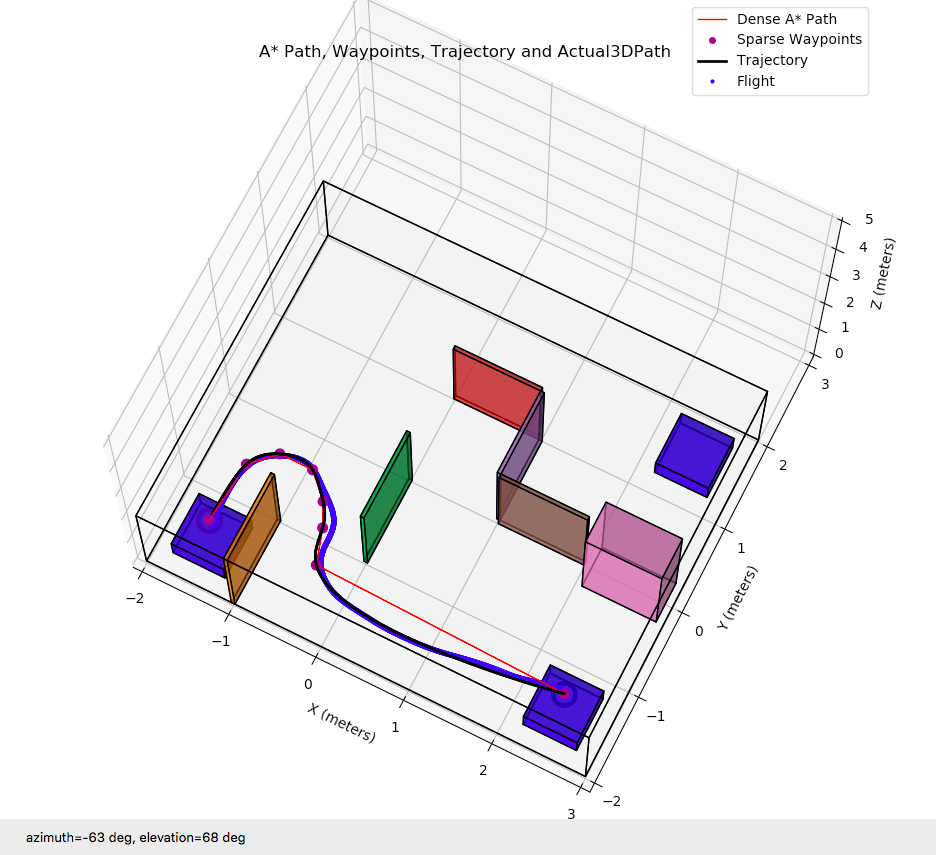

# Quadrotor
- This project includes 3 main parts: control, graph search, min-jerk trajectory design. All of them are written in python.
- Control part is implementing papers: “Minimum snap trajectory generation and control for quadrotors” from D. Mellinger and V. Kumar, and "Geometric tracking control of a quadrotor uav on SE(3)" from T. Lee, M. Leok, and N. McClamroch.
- graph search part uses Dijkstra and A* algorithm (implemented 2, but choose 1 to use) to generate collision free way points.
- trajectory is minimum-jerk(5th order), it generates the actual path for quadrotors using the pruned way-points.
- lab results:
1. control test: fly a 1m cube

2. maze tests: fly from start to end point inside a maze, use graph search and min-jerk trajectory design. Here is the lab test video:

  - 
  
Also, the actual trajectory is recorded by vicon and we can compare it to the planned trajectory. 

The actual trajectory is in blue line, generated minimum jerk trajectory is in black line, original A* path is in red line.

  - 

  - 

  - 
